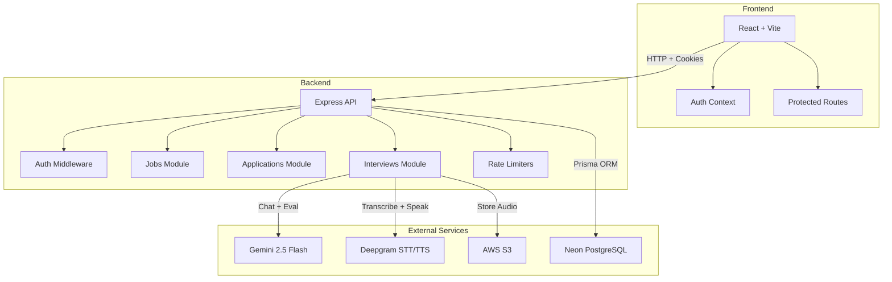

# InterviewIQ

An AI-powered interview platform that replaces traditional online assessments with intelligent, voice-based interviews. Built with the PERN stack, Google Gemini, and Deepgram.

## Features

### For Candidates
- **AI Voice Interviews** — Real-time voice-based interviews with an AI interviewer powered by Gemini 2.5 Flash
- **Mock Interviews** — Practice sessions with AI feedback and scoring
- **Instant Reports** — Detailed AI evaluation with scores across 4 dimensions

### For Recruiters
- **Job Posting** — Create job listings with tech stack, work mode, and experience level
- **Invite-Only Jobs** — Generate shareable invite links for unlisted positions
- **AI-Ranked Applicants** — Candidates are automatically scored and ranked by AI
- **Shortlist/Reject** — Make hiring decisions with the AI's recommendation as a guide

### Platform
- **Secure Auth** — HTTP-only cookie-based JWT authentication
- **Rate Limiting** — Layered protection against brute-force and API abuse
- **Anti-Manipulation** — AI interviewer cannot be tricked into breaking character
- **State Recovery** — Failed AI responses don't corrupt interview history
- **Webcam Proctoring** — Periodic snapshots during live interviews
- **Context Optimization** — Rolling window summarization keeps long interviews performant

## Tech Stack

| Layer | Technology |
|-------|-----------|
| **Frontend** | React 19, Vite, Tailwind CSS 4, React Router, Lucide Icons |
| **Backend** | Node.js, Express 5, Prisma ORM |
| **Database** | PostgreSQL (Neon) |
| **AI** | Google Gemini 2.5 Flash (Chat + Evaluation) |
| **Speech** | Deepgram Nova-3 (STT), Deepgram Aura (TTS) |
| **Storage** | AWS S3 (Audio files, Resumes) |
| **Auth** | JWT with HTTP-only cookies, bcrypt |

## Architecture



## Rate Limiting

The API uses layered rate limiters (`express-rate-limit`) to protect against abuse without blocking normal usage.

| Limiter | Scope | Limit | Purpose |
|---------|-------|-------|---------|
| **General** | All routes (except `/api/health`) | 200 req / 15 min | Baseline API protection |
| **Auth** | `POST /api/auth/login`, `POST /api/auth/register` | 10 req / 15 min | Brute-force protection |
| **Interview** | `POST /api/interview/start`, `POST /api/interview/turn` | 40 req / 15 min | Protect expensive AI/STT/TTS calls |

**Design notes:**
- Session checks (`GET /api/auth/me`), logout, and proctoring snapshots are **not** covered by the auth/interview limiters so users won't get locked out mid-session.
- Expensive AI endpoints (`/start`, `/turn`) are rate-limited separately; lightweight routes like `/snapshot` and `/finish` only count toward the general limiter.
- In production, `trust proxy` is enabled so limits are applied per client IP behind reverse proxies (Render, Vercel, etc.).

When rate-limited, the API returns **HTTP 429** with:

```json
{ "status": "fail", "message": "..." }
```

## Project Structure

```
├── backend/
│   ├── prisma/
│   │   └── schema.prisma
│   └── src/
│       ├── config/
│       │   └── db.js
│       ├── middleware/
│       │   ├── authMiddleware.js
│       │   ├── errorMiddleware.js
│       │   └── rateLimit.js
│       ├── modules/
│       │   ├── auth/
│       │   ├── jobs/
│       │   ├── applications/
│       │   └── interviews/
│       ├── utils/
│       │   ├── gemini.js
│       │   ├── deepgram.js
│       │   ├── tts.js
│       │   ├── s3.js
│       │   ├── AppError.js
│       │   ├── ApiResponse.js
│       │   └── asyncHandler.js
│       ├── app.js
│       └── server.js
│
├── frontend/
│   └── src/
│       ├── components/
│       │   ├── Navbar.jsx
│       │   ├── ProtectedRoute.jsx
│       │   ├── InterviewReport.jsx
│       │   └── ErrorBoundary.jsx
│       ├── context/
│       │   ├── AuthContext.jsx
│       │   └── ToastContext.jsx
│       ├── pages/
│       │   ├── Login.jsx
│       │   ├── Register.jsx
│       │   ├── LandingPage.jsx
│       │   ├── CandidateDashboard.jsx
│       │   ├── RecruiterDashboard.jsx
│       │   ├── InterviewRoom.jsx
│       │   ├── InterviewResults.jsx
│       │   ├── MockInterviewSetup.jsx
│       │   ├── JobApplicants.jsx
│       │   ├── ApplicantDetail.jsx
│       │   └── InviteJobView.jsx
│       ├── services/
│       │   └── api.js
│       └── App.jsx
```

## API Endpoints

### Auth
| Method | Endpoint | Description |
|--------|----------|-------------|
| POST | `/api/auth/register` | Register new user |
| POST | `/api/auth/login` | Login |
| POST | `/api/auth/logout` | Logout |
| GET | `/api/auth/me` | Get current user |

### Jobs
| Method | Endpoint | Description |
|--------|----------|-------------|
| GET | `/api/jobs` | Public job feed (excludes unlisted) |
| GET | `/api/jobs/my` | Recruiter's own jobs (includes unlisted) |
| GET | `/api/jobs/invite/:code` | Get job by invite code |
| POST | `/api/jobs` | Create job posting |

### Applications
| Method | Endpoint | Description |
|--------|----------|-------------|
| POST | `/api/applications/:jobId/apply` | Apply for a job |
| GET | `/api/applications/job/:jobId` | Get applicants for a job |
| GET | `/api/applications/:id/details` | Get application details |
| PATCH | `/api/applications/:id/verdict` | Shortlist/Reject applicant |

### Interviews
| Method | Endpoint | Description |
|--------|----------|-------------|
| POST | `/api/interview/start` | Start interview (JOB or MOCK) |
| POST | `/api/interview/turn` | Submit audio answer, get AI response |
| POST | `/api/interview/snapshot` | Upload proctoring snapshot |
| POST | `/api/interview/:id/finish` | End interview early |
| GET | `/api/interview/my` | Get user's interviews |
| GET | `/api/interview/:id` | Get interview details |

### Health
| Method | Endpoint | Description |
|--------|----------|-------------|
| GET | `/api/health` | API and database health check |

## Getting Started

### Prerequisites
- Node.js 18+
- PostgreSQL database (or [Neon](https://neon.tech) free tier)
- [Google AI Studio](https://aistudio.google.com) API key
- [Deepgram](https://deepgram.com) API key
- [AWS S3](https://aws.amazon.com/s3/) bucket

### Setup

1. **Clone the repository**
   ```bash
   git clone https://github.com/akshunshukla/Interview-IQ.git
   cd Interview-IQ
   ```

2. **Backend setup**
   ```bash
   cd backend
   cp .env.example .env
   # Fill in your environment variables in .env
   npm install
   npx prisma generate
   npx prisma db push
   ```

3. **Frontend setup**
   ```bash
   cd frontend
   cp .env.example .env
   # Update VITE_API_BASE_URL if needed
   npm install
   ```

4. **Run locally**
   ```bash
   # Terminal 1 — Backend
   cd backend && npm run dev

   # Terminal 2 — Frontend
   cd frontend && npm run dev
   ```

5. Open `http://localhost:5173`

## Environment Variables

### Backend (`backend/.env`)
| Variable | Description |
|----------|-------------|
| `DATABASE_URL` | PostgreSQL connection string |
| `PORT` | Server port (default: 8000) |
| `NODE_ENV` | `development` or `production` |
| `JWT_SECRET` | Secret key for JWT signing |
| `JWT_EXPIRES_IN` | Token expiry (e.g., `30d`) |
| `GEMINI_API_KEY` | Google Gemini API key |
| `DEEPGRAM_API_KEY` | Deepgram API key |
| `AWS_REGION` | AWS region |
| `AWS_ACCESS_KEY_ID` | AWS access key |
| `AWS_SECRET_ACCESS_KEY` | AWS secret key |
| `AWS_S3_BUCKET_NAME` | S3 bucket name |
| `CLIENT_URL` | Frontend URL (for CORS) |

### Frontend (`frontend/.env`)
| Variable | Description |
|----------|-------------|
| `VITE_API_BASE_URL` | Backend API URL |

## Deployment

| Service | Role |
|---------|------|
| **Render** | Backend API (`interview-iq-api.onrender.com`) |
| **Vercel** | Frontend (proxies `/api/*` to Render via `vercel.json`) |
| **Neon** | PostgreSQL database |
| **AWS S3** | File storage for resumes and audio |

For production:
- Set `NODE_ENV=production` on the backend
- Set `CLIENT_URL` to your Vercel frontend URL
- Set `VITE_API_BASE_URL` to your backend API URL (or use Vercel rewrites)

## License

MIT
